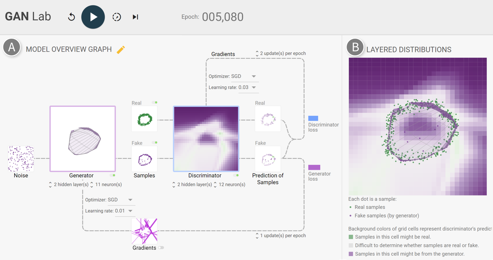

# GAN Lab: An Interactive, Visual Experimentation Tool for Generative Adversarial Networks

By Minsuk Kahng, Nikhil Thorat, Polo Chau, Fernanda Viegas, and Martin Wattenberg

**_Please note that the source code and demo in this repository are provided for reviewers of our research paper under review. GAN Lab will be officially announced by the authors later._**

## Overview

GAN Lab is an interactive visualization tool designed for non-experts to learn and experiment with Generative Adversarial Networks (GANs), a popular class of complex deep learning models. With GAN Lab, users can interactively train generative models and visually see the dynamic training process's intermediate results. GAN Lab tightly integrates an model overview graph that summarizes GAN's structure, and a layered distributions view that helps users interpret the interplay between submodels. GAN Lab introduces new interactive experimentation features for learning complex deep learning models, such as step-by-step training at multiple levels of abstraction for understanding intricate training dynamics. 

GAN Lab is mainly implemented with [TensorFlow.js Core](https://github.com/tensorflow/tfjs-core) (formerly known as deeplearn.js) and is accessible to anyone via modern web browsers, without the need for installation or specialized hardware, overcoming a major practical challenge in deploying interactive tools for deep learning.




## Working Demo

Click the following link:

[https://poloclub.github.io/ganlab/](https://poloclub.github.io/ganlab/)

It runs on most modern web browsers. We suggest you use Google Chrome on your PC.


## Development

This section describes how you can interactively develop GAN Lab.

### Install Dependencies

Run the following commands: 

```bash
$ git clone https://github.com/poloclub/ganlab.git
$ cd ganlab
$ yarn prep
```

It's unlikely, but you may need to install some basic JavaScript-related dependencies (e.g., yarn).


### Running Your Demo

Run the following command:

```bash
$ ./scripts/watch-demo

>> Waiting for initial compile...
>> 3462522 bytes written to src/bundle.js (2.17 seconds) at 00:00:00
>> Starting up http-server, serving ./
>> Available on:
>>   http://127.0.0.1:8080
>> Hit CTRL-C to stop the server
```

Then visit `http://localhost:8080/src/`. 

The `watch-demo` script monitors for changes of typescript code (e.g., `src/ganlab.ts`)
and compiles the code for you.


## More Information

Our research paper is under review. This information will be updated later.


## Contact

Minsuk (Brian) Kahng  
PhD Student at Georgia Tech  
[http://minsuk.com](http://minsuk.com)
